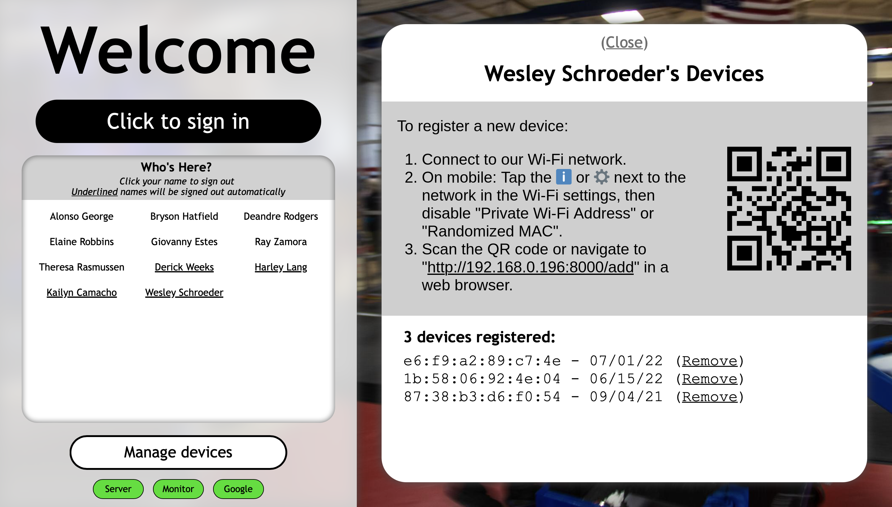

# AdvantageTrack

AdvantageTrack is an attendance system built to combine a manual sign-in interface with automated tracking of student and mentor devices. Data storage and analysis are handled using Google Sheets, updated by the local Python server. The server runs a local web app for sign-ins & status, and it monitors the active devices on the local network using intermitent flood pings. Each team member can opt-in to the automatic tracking by registering their device's MAC address with the system.

The local server can run on Linux, Windows, or macOS. No special hardware or network access is required for automatic monitoring. The frequency of flood pings is configurable, though it requires a network where ICMP echo requests are allowed. Both [iOS](https://support.apple.com/HT211227) and [Android](https://source.android.com/devices/tech/connect/wifi-mac-randomization-behavior) currently use randomized MAC addresses by default, but the system will guide users through disabling this feature _for a single network_ (meaning there is no impact to device security on other networks). This step is required because both operating systems will reset the MAC address used on a network under some conditions.


<details>
<summary>More Screenshots</summary>




</details>

## Installation & Setup

1. Set up a Google Cloud Project using [these instructions](GOOGLE.md).

2. In Google Drive, make a copy of this [Google Sheet](https://docs.google.com/spreadsheets/d/1_HIqFQeiEvepSQrMH_Ok9_99gfpYHOPBduymgrEUjlQ/edit?usp=sharing) and create a new folder for background images. Share these items to the service account email from your Google Cloud Project (the folder requires at least view access and the sheet requires at least edit access).

3. Check the configuration in the "Config - General" sheet (hover over each key for a detailed explanation). In particular, make sure to update the IP address range and background folder ID. You can also update the list of registered people in the "Config - People" sheet. **Note that the some of the sheets include sample rows. Don't delete these rows during setup; they are required for the server to correctly update the sheets.**

4. Add some JPEG or PNG images to the backgrounds folder. These will be automatically downloaded by the server (and updated periodically).

5. Clone the AdvantageTrack repository to the device which will run the server (Linux, Windows, or macOS). We recommend using a dedicated device for this purpose, such as a Raspberry Pi.

6. Copy the JSON credentials from the Google Cloud Project to the following path: `AdvantageTrack/data/google_credentials.json`

7. Update the `SPREADSHEET_ID` at the top of the `main.py` script. This is the Google Drive ID of the main AdvantageTrack spreadsheet (the last part of the URL).

8. Ensure that the following tools are installed and available on your PATH:

    - [ ] [Python 3.6](https://www.python.org/downloads/) or later

    - [ ] A modern browser of your choice

    - [ ] [`arp`](https://linuxhint.com/arp-command-linux/)

    - [ ] [`fping`](http://fping.org)

9. Install the Python dependencies. We recommend using a virtual environment for this purpose:

**Linux/macOS**

```bash
python -m venv venv
source ./venv/bin/activate
pip install -r requirements.txt
```

**Windows**

```bat
python -m venv venv
venv\Scripts\activate.bat
pip install -r requirements.txt
```

9. Launch the `main.py` script in the virutal environment and navigate to http://127.0.0.1:8000 in a browser. The status of the system will be displayed at the bottom of the page. If the background folder was linked correctly, the images will appear on this page once the downloads finish.

10. If desired, configure the OS to automatically log in, start the `main.py` script, and open a browser.

## Development

The code is formatted using the [Python](https://marketplace.visualstudio.com/items?itemName=ms-python.python) and [Prettier](https://marketplace.visualstudio.com/items?itemName=esbenp.prettier-vscode) VSCode extensions (recommended for this workspace). Python is configured to [`autopep8`](https://pypi.org/project/autopep8/) while HTML, CSS, and JS use [Prettier](https://prettier.io).

The server functionality is divided into Python modules at the root level (launched from `main.py`). All of the HTML, CSS, and JS code is under the [`www`](www) folder.

The server interfaces with Google Drive using [`gspread`](https://pypi.org/project/gspread/) and the official [Google Python API](https://pypi.org/project/google-api-python-client). The web server uses [`CherryPy`](https://cherrypy.dev) with [`ws4py`](https://ws4py.readthedocs.io/en/latest/). Most communication between the web server and browser runs over a WebSocket connection. The monitoring system invokes `fping` and `arp` using `subprocess` (it can also be disabled for testing using the `ENABLE_MONITOR` constant in `main.py`).
